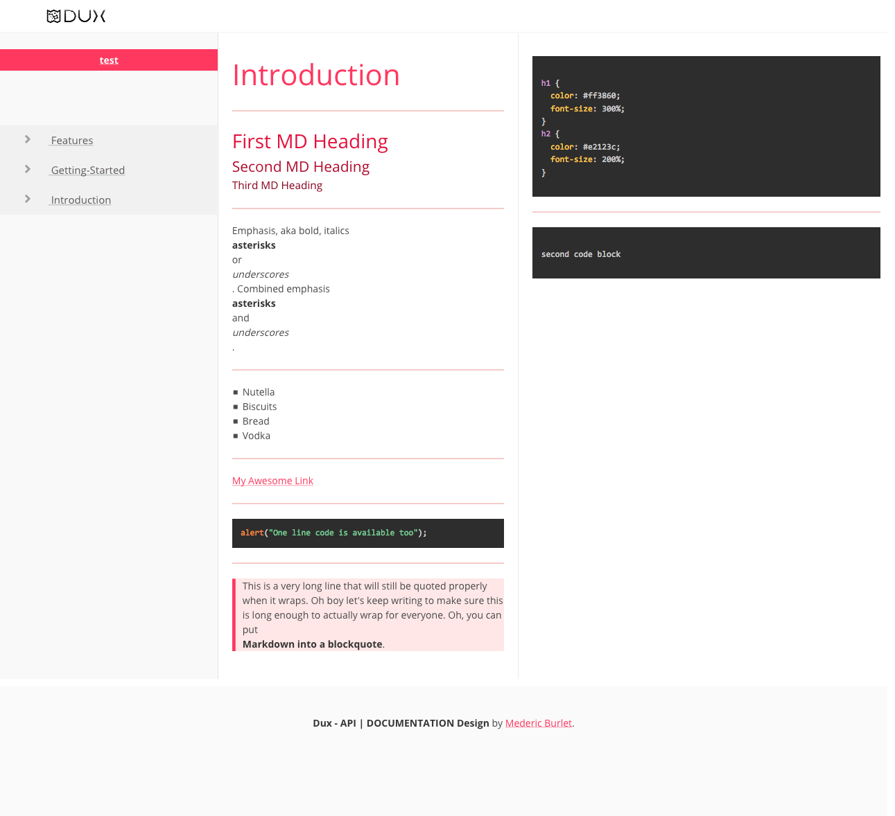

Dux (/dʌks, dʊks/; plural: ducēs)

Dux is a converter from markdown to ready to deploy websites for documentation.

It is built to lead people easily through your documentation

The idea came from the fact that I always wanted a simple consistent design for my documentation. And when I saw that services like gitbook and more were changing to become payed services. I thought why not design my own.

Markdown makes documentation writting very easy and simple and this can also be used for simple documentation.

# Things To Know

 - Each left menu item is equivalent to a `.md` file
 - The type of language for inline code is js
 - If there is no Code Block design uses one main column
 - Generates a one page website in: duxOutput


# Design Example




# To Do

 - [ ] Change css to SASS for customization
 - [ ] Add Is-Active to menu on `navigateContent`
 - [ ] Review template for menu to add ID of nav-item
 - [ ] Being able to handle Code language specification

# Future implementation

 - tables
 - .dux extension for more customizable .md
 - cards (custom example)

```html
<div class="box message-preview">
  <div class="top">
    <div class="avatar">
      
    </div>
    <div class="address">
      <div class="name">John Smith</div>
      <div class="email">someone@gmail.com</div>
    </div>
    <hr>
    <div class="content">
    </div>
  </div>
</div>
```
